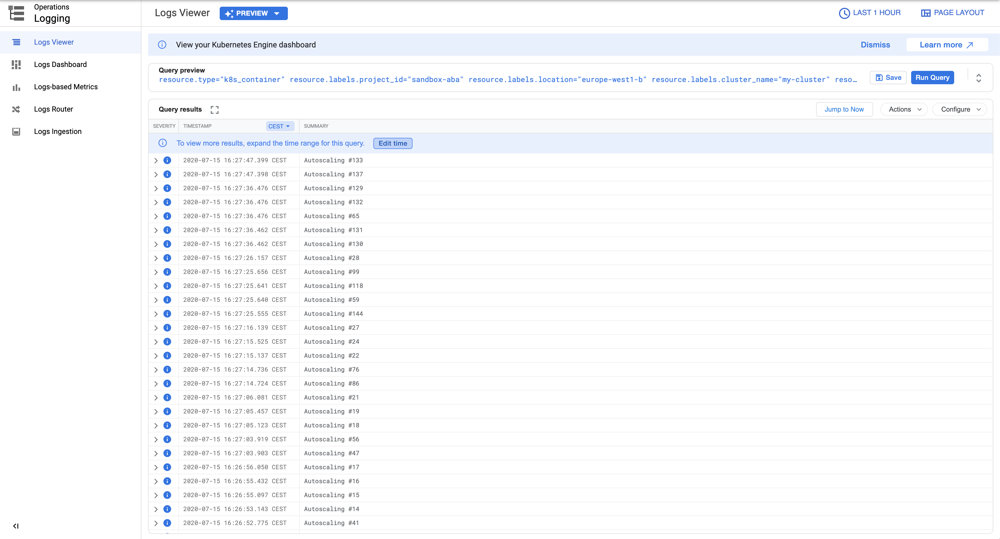

## Install

Prerequisites are:

- php & composer
- docker
- gcloud & kubectl

### Setup

```
export GCP_PROJECT_ID=xxx
```

### Build Docker image

```bash
composer install
docker build -t "gcr.io/$GCP_PROJECT_ID/php-google-pub-sub-demo" .
```

### Push Docker image on gcr.io

```bash
gcloud auth configure-docker
docker push "gcr.io/$GCP_PROJECT_ID/php-google-pub-sub-demo"
```

### Create GKE cluster

```bash
gcloud beta container --project "$GCP_PROJECT_ID" clusters create "my-cluster" \
  --zone "europe-west1-b" \
  --release-channel "regular" \
  --machine-type "e2-medium" \
  --num-nodes "3" \
  --enable-stackdriver-kubernetes \
  --enable-ip-alias \
  --network "projects/$GCP_PROJECT_ID/global/networks/default" \
  --subnetwork "projects/$GCP_PROJECT_ID/regions/europe-west1/subnetworks/default" \
  --identity-namespace "$GCP_PROJECT_ID.svc.id.goog"
```

And configure kubectl profile.

```bash
gcloud container clusters get-credentials my-cluster --zone europe-west1-b --project "$GCP_PROJECT_ID"
```

### Create gcloud service account with the right roles

```bash
gcloud iam service-accounts create php-google-pub-sub-demo --project "$GCP_PROJECT_ID"

gcloud projects add-iam-policy-binding $GCP_PROJECT_ID \
  --member "serviceAccount:php-google-pub-sub-demo@$GCP_PROJECT_ID.iam.gserviceaccount.com" \
  --role "roles/pubsub.subscriber"

gcloud iam service-accounts add-iam-policy-binding \
  --role roles/iam.workloadIdentityUser \
  --member "serviceAccount:$GCP_PROJECT_ID.svc.id.goog[default/php-google-pub-sub-demo]" \
  "php-google-pub-sub-demo@$GCP_PROJECT_ID.iam.gserviceaccount.com"
```

### Create the Pub/Sub topic and subscription

```bash
gcloud pubsub topics create my-topic --project "$GCP_PROJECT_ID"

gcloud pubsub subscriptions create my-subscription --project "$GCP_PROJECT_ID" \
  --topic=my-topic \
  --ack-deadline=60 \
  --expiration-period=never
```

### Deploy the custom metrics Stackdriver adapter

```bash
gcloud iam service-accounts create custom-metrics-sd-adapter --project "$GCP_PROJECT_ID"

gcloud projects add-iam-policy-binding "$GCP_PROJECT_ID" \
  --member "serviceAccount:custom-metrics-sd-adapter@$GCP_PROJECT_ID.iam.gserviceaccount.com" \
  --role "roles/monitoring.editor"

gcloud iam service-accounts add-iam-policy-binding \
  --role roles/iam.workloadIdentityUser \
  --member "serviceAccount:$GCP_PROJECT_ID.svc.id.goog[custom-metrics/custom-metrics-stackdriver-adapter]" \
  "custom-metrics-sd-adapter@$GCP_PROJECT_ID.iam.gserviceaccount.com"

kubectl create -f https://raw.githubusercontent.com/GoogleCloudPlatform/k8s-stackdriver/master/custom-metrics-stackdriver-adapter/deploy/production/adapter.yaml

kubectl annotate serviceaccount custom-metrics-stackdriver-adapter \
  "iam.gke.io/gcp-service-account=custom-metrics-sd-adapter@$GCP_PROJECT_ID.iam.gserviceaccount.com" \
  --namespace custom-metrics

kubectl delete pod --all -n custom-metrics
```

Source: https://cloud.google.com/kubernetes-engine/docs/tutorials/autoscaling-metrics#step1

### Deploy the app

First replace all occurrences of `sandbox-aba` in `config/app.yaml`, then:

```bash
kubectl apply -f config/app.yaml
```

## Test

### Generate some traffic

```bash
for i in {1..200}; do gcloud pubsub topics publish "projects/$GCP_PROJECT_ID/topics/my-topic" --message="Autoscaling #${i}"; done
```

### Monitor the HPA (horizontal pod autoscaler)

```bash
kubectl get hpa
```

(Output)

```
NAME                      REFERENCE                            TARGETS          MINPODS   MAXPODS   REPLICAS   AGE
php-google-pub-sub-demo   Deployment/php-google-pub-sub-demo   45/1 (avg)       1         5         5          23m
```

### Monitor the pods

```bash
kubectl get pods
```

(Output)

```
NAME                                       READY   STATUS    RESTARTS   AGE
php-google-pub-sub-demo-7f665fd475-5sdwk   1/1     Running   0          8m42s
php-google-pub-sub-demo-7f665fd475-8b8l8   1/1     Running   0          3m55s
php-google-pub-sub-demo-7f665fd475-l8jlg   1/1     Running   0          3m55s
php-google-pub-sub-demo-7f665fd475-qmmkt   1/1     Running   0          3m47s
php-google-pub-sub-demo-7f665fd475-svhcz   1/1     Running   0          3m55s
```

### See the logs

Navigate to https://console.cloud.google.com/logs/query

Use the following filter:

```
resource.type="k8s_container"
resource.labels.location="europe-west1-b"
resource.labels.cluster_name="my-cluster"
resource.labels.namespace_name="default"
labels.k8s-pod/app="php-google-pub-sub-demo"
textPayload:"Autoscaling #"
```

You see something similar to the below image.

